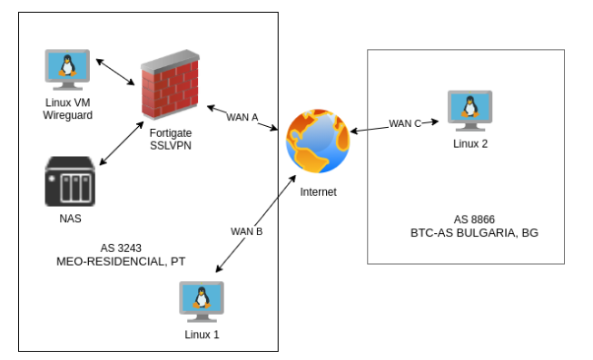

# SSLVPN vs WireGuard

## Overview

This research aims to compare the performance of two protocols, SSL VPN, and its relationship with the routing distance. SSLVPN is available on any physical firewall and WireGuard is available on Linux kernel 5.6 and above. The devices used in these tests are Linux machines, two physical and one virtual, and a Fortigate Firewall for WAN interface and SSL VPN controller illustrated in the following diagram:

# Internet speed of the WAN links and Autonomous System Number (ASN)

| WAN | ASN | Upload  | Download |
|:---:|:-----:|:-----:|:-----:|
| A | 3243 | 250 Mbps | 1 Gbps |
| B | 3243 | 100 Mbps | 200 Mbps |
| C | 8866 | 1Gbps | 500 Mbps |

The internet speeds were checked with speedtest.net 

# Devices specifications

| Device | OS | NIC | Protocol | Specs |
|:---:|:-----:|:-----:|:-----:|:-----:|
|Fortigate 200E|FortiOS 6.0.11|1 Gbps|SSL VPN|note1|
|Linux VM Wireguard|Centos 8 kernel 5.10|1 Gbps|WireGuard|2 vCPU, 4GB RAM|
|Linux machines|Centos 8 kernel 5.10|1 Gbps|SSL + WG| note2 |

note1:
Fortinet announces 900 Mbps SSL VPN throughput and 20 Gbps Firewall throughput. 
Source: https://www.fortinet.com/content/dam/fortinet/assets/data-sheets/FortiGate_200E_Series.pdf  

note2:
Linux machines have at least 6 Core Intel CPU, 16 GB RAM and SSD hard drives.

# Test considerations

- Iperf3 tests are run from the linux client acting as iperf3 client and NAS acting as a iperf server. 
- Iperf3 download test is run with -R flag from the client
- Download test consist in a file with 1.7 GBytes downloaded from the linux client through an share of the NAS running NFS v4 protocol 
- Every test was run three times and get the best time of the three
- All tests were runned outside internet rush hours - https://en.wikipedia.org/wiki/Internet_rush_hour

# SSL VPN protocol 

Linux machines connecting to Fortigate using openfortivpn software version 1.14.1 - https://github.com/adrienverge/openfortivpn 

| Device | iperf3 upload | iperf3 download | Download time | Download speed |
|:---:|:-----:|:-----:|:-----:|:-----:|
|Linux 1|114 Mbps|207 Mbps|1m10.028s|200.81 Mbps|
|Linux 2|36 Mbps|77 Mbps|3m10.638s|73.92 Mbps|

# Wireguard protocol

Linux machines connecting to Linux VM using wireguard kernel module

| Device | iperf3 upload | iperf3 download | Download time | Download speed |
|:---:|:-----:|:-----:|:-----:|:-----:|
|Linux 1|117 Mbps|210 Mbps|1m7.913s|206.67 Mbps|
|Linux 2|292 Mbps|89 Mbps|2m29.269s|94.06 Mbps|

# Conclusions

- Wireguard protocol seems to be faster then SSL VPN. 
- Routing distance factor is more important than the speed of the links. You will have a better performing tunnel on a slower link if the nodes are closer in routing distance versus higher speed links if the nodes have a greater routing distance.

